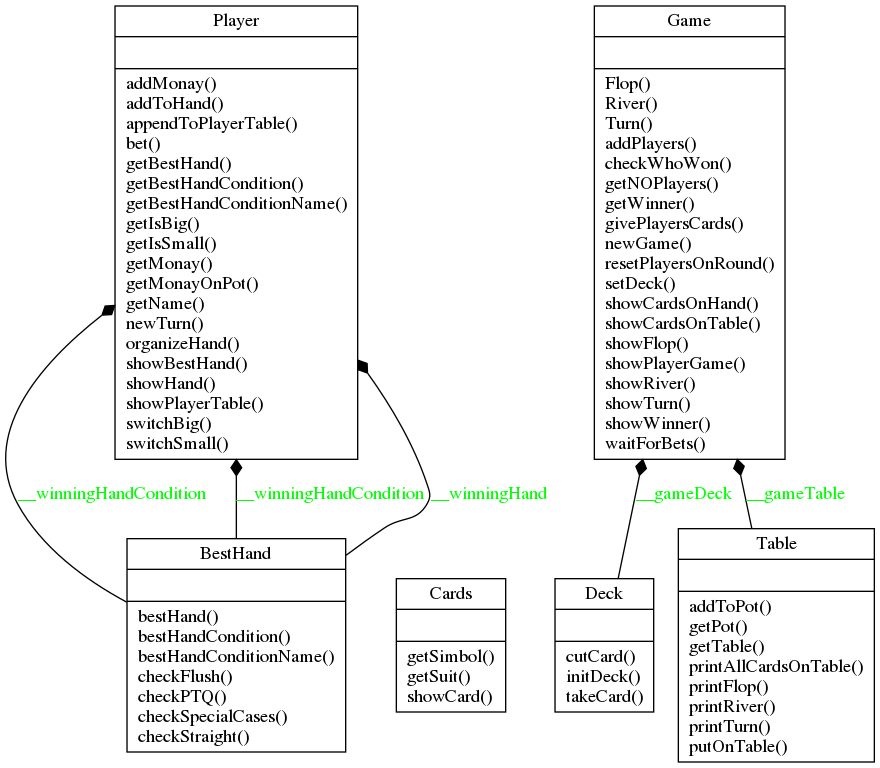
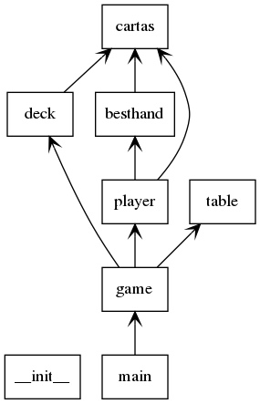

<!-- PROJECT LOGO -->
<br />
<p align="center">
  <a href="https://github.com/yohanalexander/poker-game">
    
  </a>

  <h1 align="center">Poker Game CLI</h1>

  <p align="center">
    Um incrível jogo de poker em linha de comando!
    <br />
   
<!-- ABOUT THE PROJECT -->
## Sobre o projeto

O projeto foi desenvolvido para explorar, e criar habilidades técnicas, com o paradigma de orientação a objetos das linguagens de programação. A implementação do jogo foi feita com o uso das características que são os alicerces do paradigma:

 1. Abstração
 2. Encapsulamento
 3. Herança
 4. Polimorfismo

Como é possível ver ao visualizar o seu diagrama de classes `UML`.



<!-- GETTING STARTED -->
## Funcionamento

### Pré-requisitos
A versão do interpretador `Python` utilizada no desenvolvimento foi a `3.6`, por isso para o funcionamento adequado é necessária uma distribuição acima desta versão, que pode ser gerenciada em ambientes virtuais como o `Anaconda`.
* Python>=3.6 

Em  sistemas linux utilize a linha de comando:

```sh
sudo apt install python3
```

<!-- USAGE EXAMPLES -->
## Jogando

Para iniciar o jogo basta rodar o ponto de entrada do programa:
```sh
python main.py
```
Como é possível visualizar pelo diagrama do pacote, o jogo segue seu fluxo a partir da `main`:



O jogo funciona distribuindo as cartas de maneira aleatória utilizando o método `random`.
```sh
Quantidade de jogadores(Máx: 9): 
1
Valor das fichas que seram dadas no torneio: 
100
Player 1 name: anon
Flop: Paus:9 Espadas:11 Copas:3 
Turn: Espadas:6 
River: Ouros:9 

Mesa: Paus:9 Espadas:11 Copas:3 Espadas:6 Ouros:9 

anon, sua mesa é: Copas:3 Copas:6 Espadas:6 Espadas:9 Paus:9 Ouros:9 Espadas:11 
Você compete com: Full House!
Sua mão em jogo é:Espadas:9 Paus:9 Ouros:9 Espadas:6 Copas:6 

O vencedor é: anon!
Mais um jogo? (y/n) 

```
